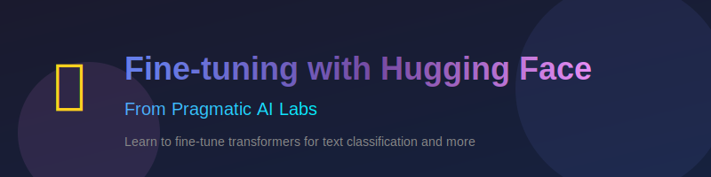

[](https://ds500.paiml.com "Pragmatic AI Labs")

This repository contains hands-on labs for the Fine-tuning with Hugging Face course from Pragmatic AI Labs.

# Fine-tuning with Hugging Face

In this course, you will learn how to fine-tune transformer models using the Hugging Face ecosystem. You'll work with datasets, tokenizers, and the Trainer API to build text classification models, handle imbalanced data, customize training, and publish your models to the Hugging Face Hub.

## Contents

This repository has several examples located in the [./examples](./examples) directory and hands-on labs in the [./labs](./labs) directory. Make sure you have Python installed and you are using [Visual Studio Code](https://code.visualstudio.com/?WT.mc_id=academic-0000-alfredodeza).

This repository is *Codespaces ready*, and it is set as a template repository. You can create a new repository from this template and start working on your own with Codespaces. This means that Python, Copilot, and all the extensions are already installed and configured for you.

[](https://codespaces.new?hide_repo_select=true&ref=main)

## Labs

Complete these hands-on labs to reinforce your learning:

| Lab | Topic | Examples Used |
|-----|-------|---------------|
| [Lab 1: Loading and Exploring Datasets](./labs/lab-1.md) | Load data from CSV, JSON, Parquet, and Hugging Face Hub | [examples/loading](./examples/loading/) |
| [Lab 2: Transformations and Tokenization](./labs/lab-2.md) | Transform datasets with map, filter, and tokenize text | [examples/transform](./examples/transform/), [examples/tokenize](./examples/tokenize/) |
| [Lab 3: Custom Datasets and Data Augmentation](./labs/lab-3.md) | Create custom datasets and handle imbalanced data | [examples/augment](./examples/augment/), [examples/imbalance](./examples/imbalance/) |
| [Lab 4: Training with Trainer API](./labs/lab-4.md) | Train models and run inference | [examples/training](./examples/training/), [examples/models](./examples/models/), [examples/inferencing](./examples/inferencing/) |
| [Lab 5: Advanced Training and Callbacks](./labs/lab-5.md) | Metrics, optimization, early stopping, and debugging | [examples/custom](./examples/custom/), [examples/callback](./examples/callback/) |
| [Lab 6: Publishing Models](./labs/lab-6.md) | Publish models to Hugging Face Hub | [examples/publishing](./examples/publishing/) |

## Course Outline

### Lesson 1: Working with Data
- [Loading datasets from different formats](./examples/loading/)
- [Transforming datasets](./examples/transform/)
- [Handling imbalanced data](./examples/imbalance/)
- [Data augmentation techniques](./examples/augment/)

### Lesson 2: Tokenization
- [Tokenization with padding](./examples/tokenize/)
- [Tokenization with truncation](./examples/tokenize/)

### Lesson 3: Models and Training
- [Working with pre-trained models](./examples/models/)
- [Training a classifier](./examples/training/)
- [Custom training configurations](./examples/custom/)

### Lesson 4: Advanced Training
- [Training callbacks and logging](./examples/callback/)
- [Optimization techniques](./examples/optimize/)

### Lesson 5: Inference and Publishing
- [Running inference](./examples/inferencing/)
- [Publishing models to Hugging Face Hub](./examples/publishing/)

## Local Setup

If you prefer to work locally instead of using Codespaces:

1. Clone this repository:
   ```bash
   git clone https://github.com/alfredodeza/hf-finetuning.git
   cd hf-finetuning
   ```

2. Create a virtual environment:
   ```bash
   python -m venv .venv
   source .venv/bin/activate  # On Windows: .venv\Scripts\activate
   ```

3. Install dependencies:
   ```bash
   pip install -r examples/requirements.txt
   ```

4. Open in VS Code:
   ```bash
   code .
   ```

## Resources

- [Hugging Face Documentation](https://huggingface.co/docs)
- [Transformers Library](https://huggingface.co/docs/transformers)
- [Datasets Library](https://huggingface.co/docs/datasets)
- [Hugging Face Course](https://huggingface.co/course)

**Coursera Courses**

- [MLOps Machine Learning Operations Specialization](https://www.coursera.org/specializations/mlops-machine-learning-duke)
- [Linux and Bash for Data Engineering](https://www.coursera.org/learn/linux-and-bash-for-data-engineering-duke)
- [Open Source Platforms for MLOps](https://www.coursera.org/learn/open-source-platforms-duke)
- [Python Essentials for MLOps](https://www.coursera.org/learn/python-essentials-mlops-duke)
- [Web Applications and Command-Line tools for Data Engineering](https://www.coursera.org/learn/web-app-command-line-tools-for-data-engineering-duke)
- [Python and Pandas for Data Engineering](https://www.coursera.org/learn/python-and-pandas-for-data-engineering-duke)
- [Scripting with Python and SQL for Data Engineering](https://www.coursera.org/learn/scripting-with-python-sql-for-data-engineering-duke)
